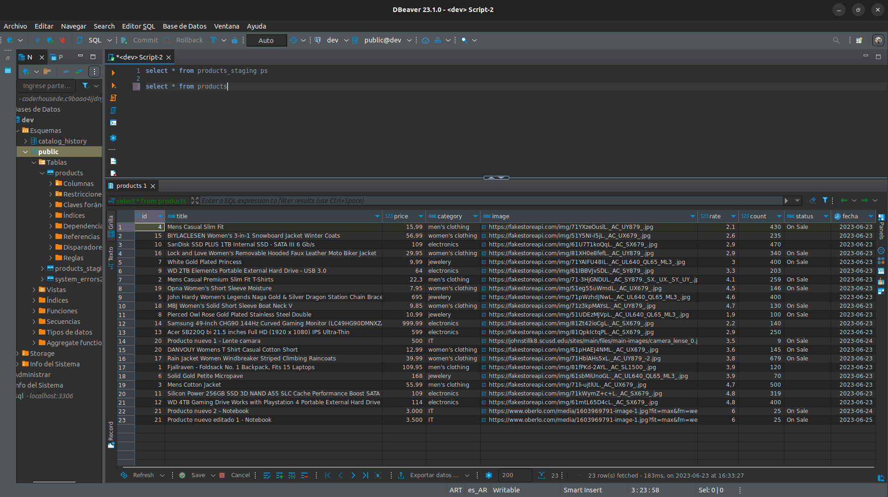

# Documentacion ETL con Pandas / Spark 

En el presente desarrollo se procede a extraer datos de una API con datos de de productos para su posterior analisis y guardado en DataWarehouse

> Antes de ejecutar el codigo se necesita instalar las dependencias con ` pip3 install -r requeriments.txt ` en la carpeta raiz del Notebook
___

## Transformacion de datos a realizar:
- Split columna rating en rate / count
- Productos en oferta
- Cantidad de productos por categoria
- Top 10 productos

___
***Se debe aclarar que el desarrollo hecho con Pandas es meramente practico, no va a quedar asi para el proximo entregable, por cuestiones de tiempo se realizo con esta libreria pero en un entorno productivo se usara Spark (aunque con pocos datos tenga menos rendimiento) debido a que de cara a futuro y a un requerimiento mayor es mejor herramienta, asi como tambien la insercion de los datos en destino***

***Otra cosa para destacar es que el resultado de dicho analisis depende del funcionamiento del servicio de consulta de datos [Fake Store API](https://fakestoreapi.com/), en caso que dicho endpoint no funcione no se podra ver el resultado del ejercicio correctamente.***

## Correcciones respecto al ejercicio anterior:
- Se ignora el archivo .DS_Store
- Se enriquecio con contenido el archivo README.md
- Se generan mas variables de entorno
- Se agrega fecha de carga en cada producto
- Se quita columna descripcion
- Se agregan registros extra con otras fechas

## Se adjunta captura de insercion de datos en destino debido a que la cuenta no es de Coder y no pueden entrar los profes:

