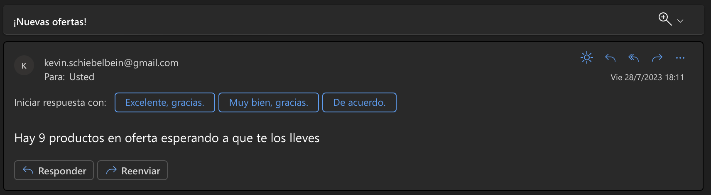

# Documentacion Sensores en thresholds

En base al entregable anterior, se suma la feature de poder ejecutar acciones mediante sensores en el flujo de datos creado para su aprovechamiento y explotacion de la data.
Se implementa un PythonSensor para detectar cuando hay productos en oferta, enviando un correo electronico a un destinatario para iniciar un accionar en base a sus necesidades.

## Se adjunta captura del correo electronico enviado:

